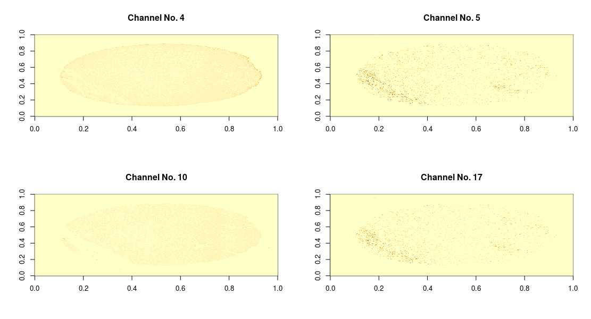

# Using OSN on TMA Data

The Open Storage Network has allowed the Bioconductor project expanded
offerings to cloud data. We demonstrate the usage of the `RemoteZarr`
class to access Tissue MicroArray (TMA) data, one 'core' at a time.

```{r}
library(ZarrExperiment)
```

# Data Location

https://mghp.osn.xsede.org/bir190004-bucket01/index.html#TMA11/zarr/

There are about 123 cores within the OSN storage location above. Cores are
numerically labeled e.g., `1.zarr` corresponds to core number one. 

# Data Representation

## ZarrRemote class

```{r}
showClass("ZarrRemote")
```

## endpoint and bucket inputs

The `endpoint` corresponds to the OSN website and the `bucket` input corresponds
to the bucket name and subfolders where the `.zarr` archives can be located.

```{r}
zr <- ZarrRemote(
    endpoint = "https://mghp.osn.xsede.org/",
    bucket = "bir190004-bucket01/TMA11/zarr/"
)
zr
```

## URL input

A URL may also be used as the `resource` input. Both the `endpoint` and the
`bucket` location will be deduced when possible.

```{r}
zr <- ZarrRemote(
    resource = "https://mghp.osn.xsede.org/bir190004-bucket01/TMA11/zarr/"
)
zr
```

# Data Retrieval

Currently, data retrieval is possible on a single directory via the `import`
method on the `ZarrRemote` class.

## ZarrRemote `import` method

The `import` method makes internal use of the `s3fs` python module:

```{r}
getMethod(import, "ZarrRemote")
```

This operation takes about three minutes to complete and produces an array
object of approximately 2.3 GB.

```{r,eval=FALSE}
system.time({
  c99 <- import(zr, filename = "99.zarr")
})
#'   user  system elapsed 
#' 15.342   4.152 182.009

object.size(c99)
#' 2314764768 bytes

object_size(c99, unit = "GB", standard = "SI")
#' [1] "2.3 GB"
```

## Image from channels 4, 5, 10, 17

```{r,eval=FALSE}
par(mfrow = c(2, 2))
for (channel in c(4, 5, 10, 17))
    image(
        c99[channel, , ],
        main = paste0("Channel No. ", as.character(channel)),
        useRaster = TRUE
    )
```

```{r,echo=FALSE}

```


# Session Info

```{r}
sessionInfo()
```


